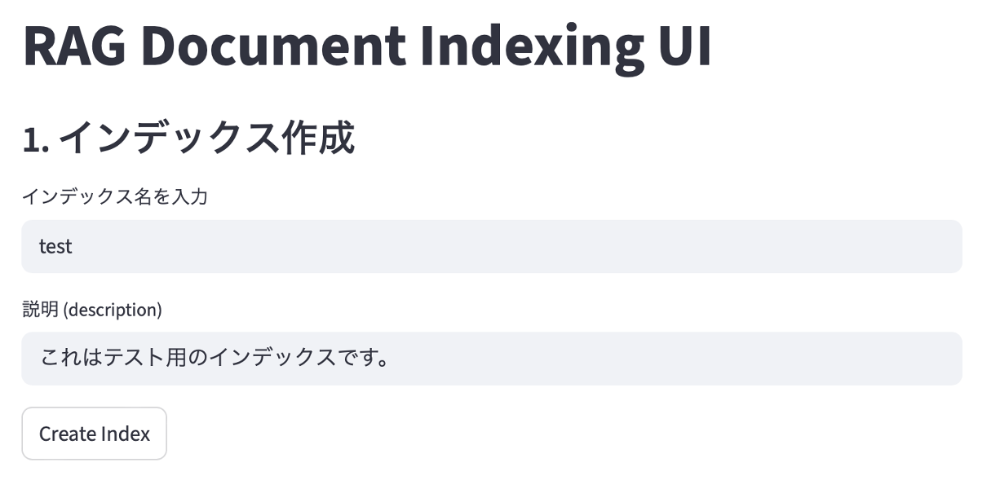

# agent-rag-app
## 概要
AI AgentによるRAG型チャットボット
## 使用技術
- Agent & Chat UI: Google ADK
- MCP Server: Fast MCP
- API Server: Fast API
- Indexing UI: Streamlit
- LLM: Gemini API
- Other: Docker
## 環境構築/実行手順
1. プロジェクトのclone  
    このプロジェクトを以下のコマンドでCloneする。
    ```bash
    git clone https://github.com/kazuki-saito803/agent-rag-app.git
    ```
1. Gemini APIキーの取得  
    以下のリンクから無料でGeminiのAPIキーを取得する。  
    [Google AI Studio](https://aistudio.google.com/u/1/api-keys)
1. Docker Desktopをインストール  
    以下のサイトからDocker Desktopをインストールする。  
    [https://docs.docker.com/desktop/](https://docs.docker.com/desktop/)
1. 環境変数を設定する  
    Cloneしたプロジェクトのディレクトリ直下で.envファイルを作成。
    以下の環境変数を入力
    ```txt
    GEMINI_API_KEY="<作成したGeminiのAPIキー>"
    GOOGLE_GENAI_USE_VERTEXAI="FALSE"
    MODEL="gemini-2.0-flash"
    ELASTICSEARCH_ENDPOINT="http://elasticsearch:9200"
    API_SERVER_URL="http://indexing-server:8002"
    API_SEVER_PORT="8002"
    MCP_SEVER_URL="http://mcp-server:8001"
    MCP_SEVER_PORT="8001"
    ```
1. Docker Composeでコンテナを立ち上げる。  
    以下のコマンドを実行  
    ```bash
    docker-compose up -d --build
    ```
    ※事前にDockerのプロセスが起動している必要があります。必要に応じてDocker Desktopを起動してください。  
1. Index作成用UIに遷移  
    以下のURLをブラウザで検索  
    [Index用UI画面](http://localhost:8501)
1. Indexの作成  
    UIよりIndex名とその説明を入力して実行  
    
1. 作成したIndexに中身を追加  
    UIより事前に作成したIndex名, 説明, Indexing対象の文章, チャンクサイズを入力して実行  
    
1. チャットUIに移動  
    ブラウザで以下のURLを検索  
    [http://localhost:8000](http://localhost:8000)  
1. プロンプトを入力して実行
1. その他  
    Index作成用UIからプロンプトに応じた検索結果の確認やIndex一覧確認、Index削除なども行えます。